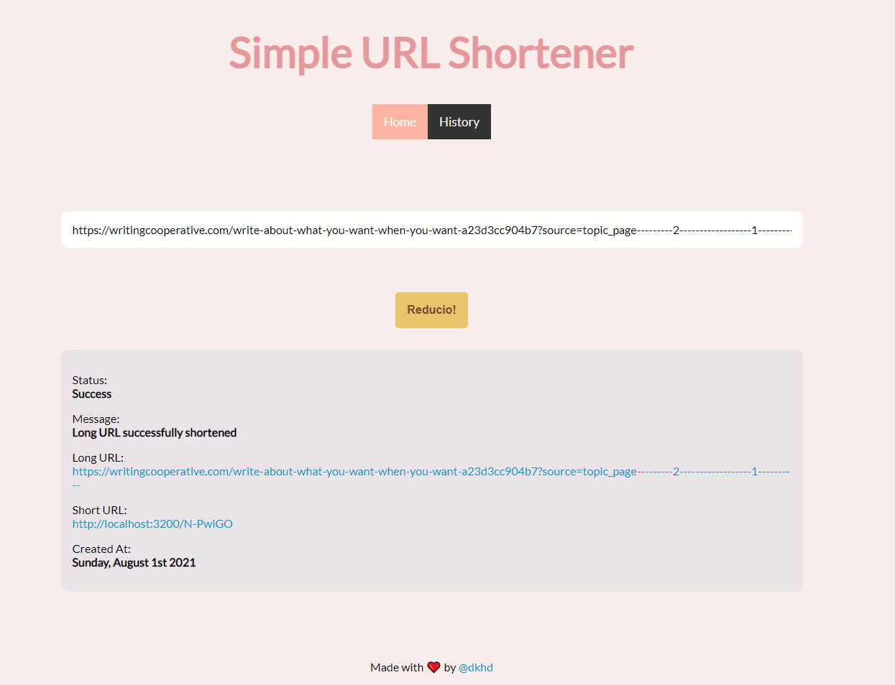

# Simple URL Shortener

As the title says, this is a (relatively) simple URL shortener.

The project contains 2 major parts: the _backend_ part and the _frontend_ part, and all of them are built using JS. Please make sure you have the latest Node.js installed on your system before you run this project.

# Features

There are 3 main features in this project:
* Shorten the URL
* View the history of the shortened URLs
* Interstitial page

## Shorten The URL

The main feature of this project, it will generate a short URL from your long URL.

## History

You can check all your previously shortened URLs. The data is shown in a paginated table.

## Interstitial Page

A page that will be shown before the user is redirected to the long URL. This page will display an error message when the short URL is not found in the database.

# Backend

The backend utilize ExpressJS as its core, and it has 3 endpoints.

## [GET] /create

This endpoint is meant to create the short URL from the

## [GET] /get-all

This endpoint is meant to get all previously shortened URLs.

## [GET] /{*}

This endpoint is meant to check if given short URL is exist in the database.

# Database

For this project, I'm using `lowdb` as the database. It's light, simple, and easy to use!

# Frontend

The frontend utilize ReactJS as its core, and it has 3 pages.

## /

The homepage of this project. This is where you will shorten your long URL.

## /history

This page will show the previously shortened URLs.

## /{*}

This page will take any short URL you give, and check it to database.

If the short URL is exist, you will be redirected to the long URL, but if the short URL does not exist, it will show an error message.

# Note

Since the current state of this project is not production-ready, the database will reset & repopulated every time you restart your backend.

# How To Run

To use this project, you need to open 2 tabs (or windows) of your terminal (1 for running the backend, 1 for running the frontend). 

* `$ cd backend` from your first tab/window to open the backend directory.
* `$ cd frontend` from your second tab/window to open the frontend directory.

Next, run these commands for both backend and frontend:

* `$ npm install` to install all the dependencies.
* `$ npm start` to start running the service.

_Reducio!_